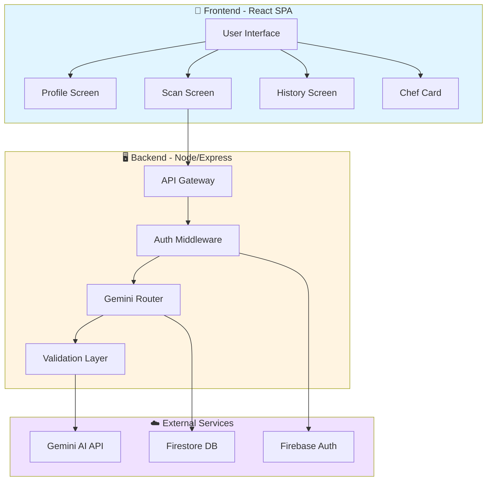
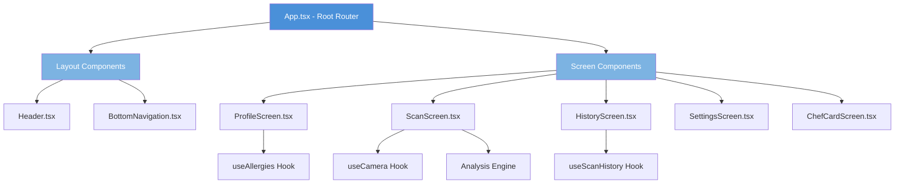
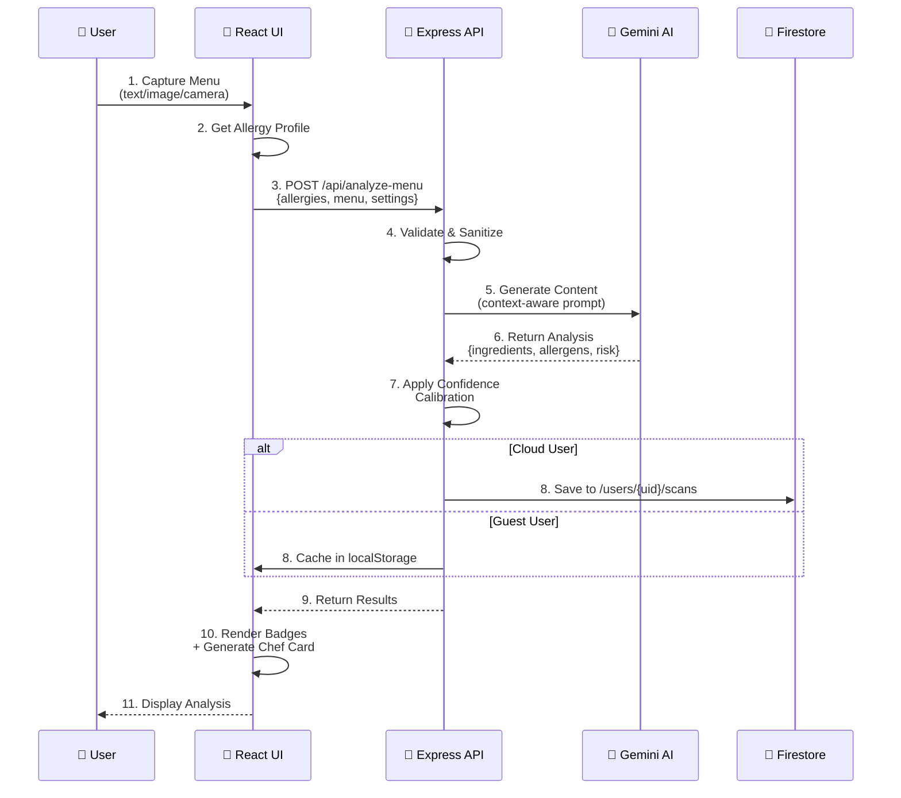
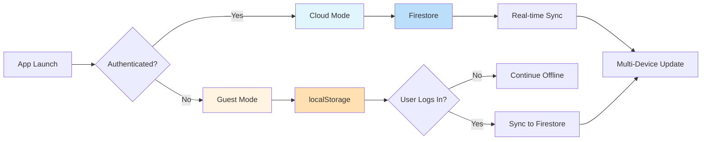
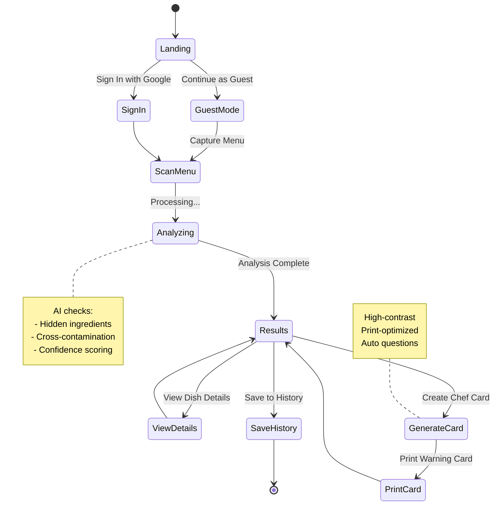
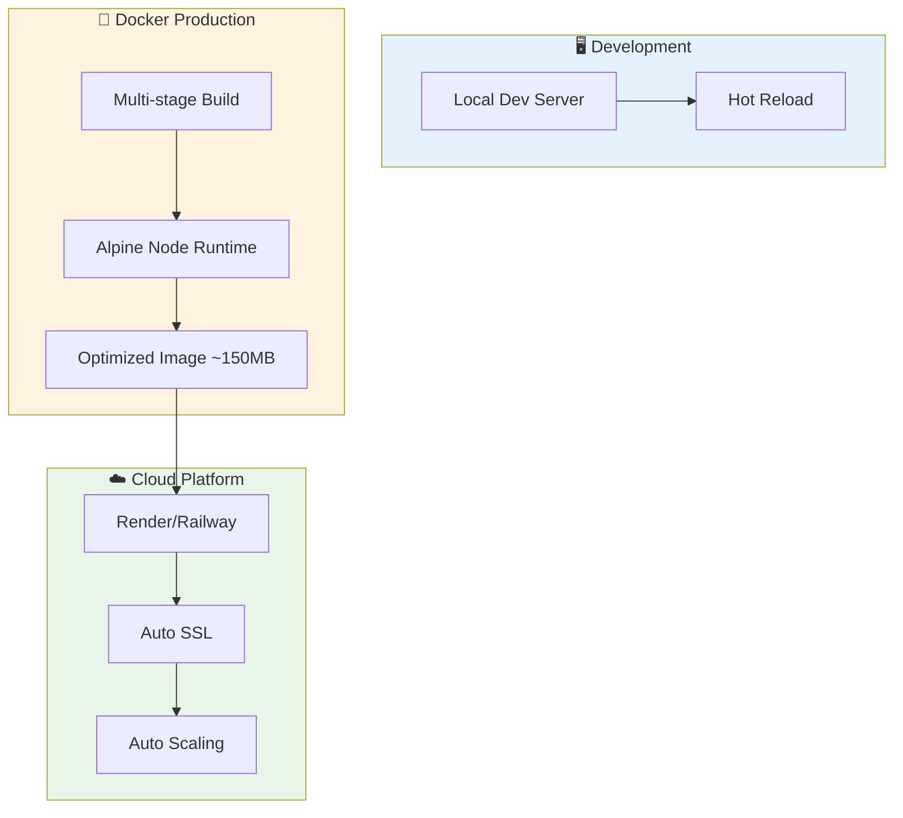

# 🛡️ AllergySafe Guardian

> **Real-Time AI Menu Analyzer & Severe Food Allergy Dining Companion**

<p align="center">
  
  
  
  
  
  
</p>

<p align="center">
  <strong>🍽️ Eat with Confidence • 🌍 Travel Safely • 🤖 AI-Powered Protection</strong>
</p>

---

## 📋 Table of Contents

- [🌟 Overview](#-overview)
- [✨ Key Innovations](#-key-innovations)
- [🏗️ Architecture](#️-architecture)
- [🔄 Data Flow](#-data-flow)
- [🚀 Quick Start](#-quick-start)
- [🌐 API Reference](#-api-reference)
- [⚙️ Firebase Setup](#️-firebase-setup)
- [📦 Deployment](#-deployment)
- [⚠️ Medical Disclaimer](#️-medical-disclaimer)
- [📄 License](#-license)

---

## 🌟 Overview

**AllergySafe Guardian** is a cutting-edge dining companion that leverages Google's Gemini AI to analyze restaurant menus in real-time, identifying potential allergen risks for users with severe food allergies.

### 🎯 What It Does

| Feature | Benefit |
|---------|---------|
| 🔍 **Tri-Input Scanner** | Capture menus via text paste, image upload, or live camera |
| 🧠 **AI Reasoning** | Detect hidden ingredients & cross-contamination risks |
| 🎚️ **Vigilance Modes** | Choose safety strictness: Extreme, Standard, or Flexible |
| 🌐 **Multi-Language** | Translate results to communicate with kitchen staff worldwide |
| 🖨️ **Chef Warning Card** | Generate printable, high-contrast allergy alerts |
| ☁️ **Hybrid Sync** | Offline-first with automatic cloud backup via Firebase |

---

## ✨ Key Innovations

### 📸 Tri-Input Scanner

Capture menus your way:

- **📋 Clipboard**: Paste text from digital menus
- **📁 File Upload**: Upload JPEG, PNG, or WebP images
- **🎥 Live Camera**: Snap photos using device camera via WebRTC

### 🧠 GenAI Allergen Reasoning

Powered by Google Gemini 2.5 (Flash & Pro):

| Menu Item | Inferred Allergens | Why |
|-----------|-------------------|-----|
| 🥗 Pesto | Tree nuts, Dairy | Contains pine nuts, parmesan |
| 🍝 Béchamel | Dairy, Gluten | Made with butter, flour, milk |
| 🥢 Soy Sauce | Wheat, Soy | Traditional fermentation |
| 🧄 Aioli | Egg, Garlic | Egg yolk emulsion base |

### 🎚️ Vigilance Thresholds

Customize safety sensitivity:

- **🔴 Extreme**: Flag anything with reasonable doubt
- **🟡 Standard**: Balanced risk assessment (default)
- **🟢 Flexible**: Only flag high-probability risks

### 📊 Confidence Calibration

Safety-first post-processing: If AI returns "SAFE" but confidence < 70%, result auto-upgrades to **POSSIBLE_RISK** with a verification notice.

### 🌍 Native Translation

Output results in 50+ languages to communicate clearly with international kitchen staff.

### 🖨️ Chef Warning Card

Print-ready, high-contrast allergy alert card featuring:
- Bold life-threatening allergy warnings
- Dynamic ingredient lists from user profile
- Auto-generated "Ask the Chef" questions
- Print-optimized CSS that hides all non-essential UI

---

## 🏗️ Architecture

### System Architecture Diagram



### Component Hierarchy



### Tech Stack

| Layer | Technology |
|-------|-----------|
| Frontend | React 18 + TypeScript + Vite + Tailwind CSS |
| Backend | Node.js + Express + TSX |
| AI | Google Gemini 2.5 (Flash/Pro) |
| Auth | Firebase Authentication (Google OAuth) |
| Database | Cloud Firestore |
| Deployment | Docker + Multi-stage builds |

### Project Structure

```
allergy-safe-menu-scanner/
├── src/
│   ├── components/     # UI components (layout + screens)
│   ├── hooks/          # Custom React hooks
│   ├── lib/            # Utilities & config
│   ├── firebase.ts     # Firebase client setup
│   ├── main.tsx        # App entry point
│   └── App.tsx         # Root router & context
├── server.ts           # Express API + Gemini router
├── firestore.rules     # Security rules
├── Dockerfile          # Production container
├── package.json        # Dependencies & scripts
└── tsconfig.json       # TypeScript config
```

---

## 🔄 Data Flow

### End-to-End Analysis Flow



### Data Persistence Flow



### User Journey Flow



---

## 🚀 Quick Start

### ✅ Prerequisites

- Node.js v22+ 
- Google Gemini API Key ([Get one here](https://aistudio.google.com/))
- Firebase Project ([Console](https://console.firebase.google.com/))

### 📥 1. Clone & Install

```bash
git clone https://github.com/mohd-ali10/allergy-safe-menu-scanner.git
cd allergy-safe-menu-scanner
npm install
```

### ⚙️ 2. Configure Environment

Create `.env.local` in project root:

```env
PORT=3000
GEMINI_API_KEY=your_gemini_api_key_here
```

### 🔥 3. Firebase Config

Create `firebase-applet-config.json` in root:

```json
{
  "projectId": "YOUR_PROJECT_ID",
  "appId": "YOUR_APP_ID",
  "apiKey": "YOUR_API_KEY",
  "authDomain": "YOUR_PROJECT_ID.firebaseapp.com",
  "firestoreDatabaseId": "(default)",
  "storageBucket": "YOUR_PROJECT_ID.appspot.com",
  "messagingSenderId": "YOUR_SENDER_ID"
}
```

### ▶️ 4. Start Development

```bash
npm run dev
```

Visit `http://localhost:3000` to begin.

---

## 🌐 API Reference

### POST `/api/analyze-menu`

Analyze menu content against user allergy profile.

#### Request Body

| Field | Type | Required | Description |
|-------|------|----------|-------------|
| `allergies` | string[] | ✅ | Allergens to check: `["dairy", "gluten", "peanuts", ...]` |
| `menuText` | string | ⚠️ | Plain text menu (required if no image) |
| `image` | string | ⚠️ | Base64 image (required if no menuText) |
| `strictness` | string | ❌ | `"flexible"`, `"standard"`, `"extreme"` (default: standard) |
| `outputLanguage` | string | ❌ | Language for results (default: English) |
| `modelSelected` | string | ❌ | `"gemini-2.5-flash"` or `"gemini-2.5-pro"` |

#### Example Request

```json
{
  "allergies": ["dairy", "gluten"],
  "menuText": "Creamy Mushroom Risotto with parmesan",
  "strictness": "extreme",
  "outputLanguage": "English"
}
```

#### Example Response

```json
[
  {
    "dish": "Creamy Mushroom Risotto",
    "ingredients": ["Arborio Rice", "Mushrooms", "Parmesan", "Butter", "Cream"],
    "allergens": ["dairy", "gluten"],
    "risk": "HIGH_RISK",
    "explanation": "Contains dairy from parmesan, butter, and cream. Risotto may use gluten-containing stock.",
    "confidence": 96,
    "chefQuestions": [
      "Is the stock gluten-free?",
      "Can this be prepared without butter or cream?"
    ]
  }
]
```

#### Error Responses

| Code | Meaning |
|------|---------|
| `400` | Missing required fields |
| `401` | Invalid API key or auth token |
| `413` | Image too large (>10MB) |
| `429` | Rate limit exceeded |
| `500` | Internal server error |

---

## ⚙️ Firebase Setup

### 1. Enable Google Sign-In

Firebase Console → Authentication → Sign-in method → Enable **Google**

### 2. Apply Security Rules

```javascript
rules_version = '2';
service cloud.firestore {
  match /databases/{database}/documents {
    match /users/{userId} {
      allow read, write: if request.auth != null && request.auth.uid == userId;
      match /scans/{scanId} {
        allow read, write, delete: if request.auth != null && request.auth.uid == userId;
      }
    }
  }
}
```

### 3. Firestore Data Structure

```
/users/{userId}
  ├── /profile
  │   ├── allergies: string[]
  │   ├── dietaryPreference: string
  │   └── strictness: string
  └── /scans/{scanId}
      ├── dish: string
      ├── risk: string
      ├── timestamp: timestamp
      └── ingredients: string[]
```

---

## 📦 Deployment

### 🚀 Cloud Platforms (Render / Railway / Heroku)

1. Connect GitHub repo
2. Set build command: `npm install && npm run build`
3. Set start command: `npm start`
4. Add env var: `GEMINI_API_KEY`

### 🐳 Docker

```bash
# Build
docker build -t allergy-safe-scanner .

# Run
docker run -p 3000:3000 -e GEMINI_API_KEY="your_key" allergy-safe-scanner
```

### Deployment Architecture



---

## ⚠️ Medical Disclaimer

> **AllergySafe Guardian is an AI assistant, not a medical device.**

- ❗ AI can make mistakes — always verify with restaurant staff
- ✅ Cross-check results before consuming any food
- 🔄 Re-scan if menu items or preparation methods change
- 🆘 Always carry emergency medication (e.g., epinephrine)
- 🌐 Use translation features to communicate clearly with kitchen teams

**This application does not replace professional medical advice.**

---

## 📄 License

MIT License — See [`LICENSE`](LICENSE) for details.

---

<p align="center">
  <strong>🛡️ Built for safer dining experiences worldwide</strong><br/>
  <sub>Made with ❤️ by the AllergySafe Guardian Team</sub>
</p>

<p align="center">
  <a href="#-allergysafe-guardian">⬆️ Back to Top</a>
</p>